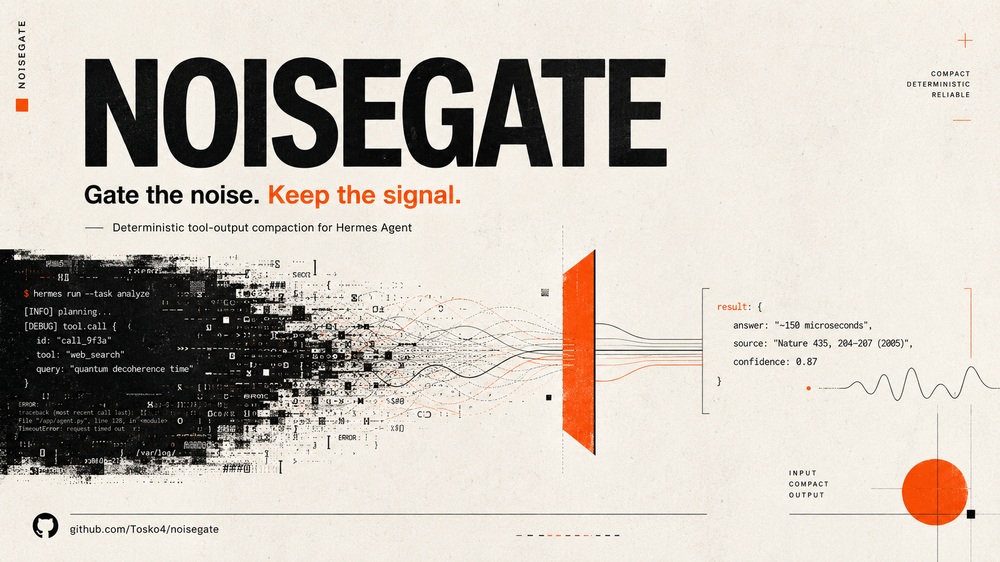

# Noisegate

<p align="center">
  
</p>

<p align="center">
  <a href="https://github.com/Tosko4/noisegate/actions/workflows/ci.yml"></a>
  <a href="https://github.com/Tosko4/noisegate/releases"></a>
  <a href="LICENSE"></a>
  
</p>

**Gate the noise. Keep the signal.**

Noisegate is a small, deterministic compaction layer for Hermes Agent. It catches the terminal walls, test-log avalanches, build spam, and other context-gremlins before they flood your model window.

It does not call a model. It does not vibe-summarize your logs. It does not pretend a chopped-off wall of text is "analysis".

It keeps the useful bits, leaves exact content alone, and gets out of the way when it is not sure.

```bash
uvx --from noisegate-hermes noisegate install-hermes
```

That is the normal install/update path for an existing Hermes Agent setup.

## The problem

Agents are great at running tools.

Tools are great at producing nonsense amounts of output. Truly Olympic levels of nonsense.

A single test run, package install, Docker build, or search command can dump thousands of lines into context. Most of it is noise. Some of it matters. If you blindly truncate it, you lose the useful part. If you blindly keep it, you burn context and make the next model call worse.

Noisegate sits in the middle:

```text
noisy tool output  ->  Noisegate  ->  compact signal-rich result
```

It is built for agent work where the context window is valuable and exactness matters.

## What you get

Noisegate gives you two surfaces:

- a **Hermes plugin** that can compact noisy tool results before they enter the conversation
- a **CLI** you can use directly in terminals, scripts, CI jobs, and smoke tests

It knows how to reduce common noisy outputs:

- `pytest` and `unittest`
- `apt` / `apt-get`, `pip`, and `uv` package-install/update logs, including resolver failures before a `uv run` command starts
- `npm`, `pnpm`, and `yarn`
- `git status` and `git log`
- Docker build-style logs and explicit `docker logs`, `docker service logs`, and `docker compose logs` output
- Hermes background `process` poll/log/wait payloads when the underlying command or diagnostic content identifies a known noisy stream, including Docker, journalctl, `systemctl status`, dmesg, and follow-mode tail output from known log targets, while keeping process metadata intact; commandless non-diagnostic previews, followed source/config files, and `systemctl show` properties stay exact
- generic long output with deterministic head/tail fallback

And it refuses to touch things that should stay exact:

- file reads, including `fd` / `fdfind` execution forms that directly display matching files when no later noisy command owns the captured output
- patches and diffs
- source/code search output from `rg`, `grep`, `ag`, and `ack`
- skill documents
- memory, LCM, Hindsight, MCP, search, and web extraction results
- terminal retrieval output from LCM, Hindsight, memory, and session-search commands, including path-qualified retrieval helpers
- unknown future tools unless explicitly allowed

That last bit matters. A compactor that damages retrieved context is worse than no compactor.

Hermes-LCM stays a separate recovery layer. Noisegate does not depend on it and does not replace it:
`lcm_*` tool results stay exact, `externalized_ref` metadata is left alone, and compacted
terminal-style output preserves LCM externalized payload placeholders such as
`[Externalized tool output: ... ref=...]`. The early terminal hook still disables Noisegate raw
artifacts, so pre-redaction terminal output is not persisted just because an LCM ref appears.

The maintainer checklist lives in [`docs/product-contract.md`](docs/product-contract.md). Product changes should improve context value and safety boundaries, not just make output shorter.

## Install or update

Noisegate is distributed as the Python package `noisegate-hermes`. The Hermes plugin must be installed into the same Python environment that runs `hermes`.

Most users want this:

```bash
uvx --from noisegate-hermes noisegate install-hermes
```

Use the same command for first install and updates.

It finds `hermes` on `PATH`, verifies that the launcher points at a Hermes Python console script or supported Hermes shim inside a virtual environment, installs `noisegate-hermes` there, enables the `noisegate` plugin, removes any stale `plugins.disabled` entry for `noisegate`, and runs `noisegate doctor`. Native Windows launchers are opaque binaries, so Noisegate validates those by requiring an adjacent virtual-environment Python.

Preview the exact commands first. Dry-run mode does not run the install/enable/doctor commands and does not restart or reload Hermes:

```bash
uvx --from noisegate-hermes noisegate install-hermes --dry-run
```

If Hermes is running as a long-lived gateway/service, restart or reload that Hermes process through your normal maintenance flow after installing so the plugin/config change is picked up. Do not kick the chair out from under in-flight agent work.

From a checkout, install that exact checkout into Hermes:

```bash
uv run noisegate install-hermes --package .
```

Noisegate registers two Hermes hooks:

```text
transform_terminal_output
transform_tool_result
```

### npm wrapper

The npm package is a thin installer wrapper. The Python package is still the real thing.

If you prefer npm-shaped commands:

```bash
npx -p noisegate-hermes noisegate install-hermes
```

If your npm client does not resolve the single-bin shortcut, use:

```bash
npx -p noisegate-hermes noisegate-hermes-installer install-hermes
```

<details>
<summary>Manual fallback for unusual Hermes launchers</summary>

Prefer `noisegate install-hermes`. Use this only when you need to inspect or reproduce the low-level install flow manually.

```bash
HERMES_PYTHON="$(head -1 "$(command -v hermes)" | sed 's/^#!//')"
case "$(basename "$HERMES_PYTHON")" in
  python*|pypy*) ;;
  *) echo "Hermes launcher is not a Python console script; use noisegate install-hermes" >&2; exit 1 ;;
esac
HERMES_PREFIX="$(dirname "$(dirname "$HERMES_PYTHON")")"
if [ ! -f "$HERMES_PREFIX/pyvenv.cfg" ]; then
  echo "Hermes Python is not inside a virtual environment; use noisegate install-hermes" >&2
  exit 1
fi
uv pip install --python "$HERMES_PYTHON" noisegate-hermes
"$HERMES_PYTHON" - <<'PY'
from hermes_cli.config import load_config, save_config
cfg = load_config()
plugins = cfg.setdefault("plugins", {})
changed = False
raw_enabled = plugins.get("enabled")
enabled = list(raw_enabled) if isinstance(raw_enabled, list) else []
if "noisegate" not in enabled:
    enabled.append("noisegate")
if raw_enabled != enabled:
    plugins["enabled"] = enabled
    changed = True
raw_disabled = plugins.get("disabled")
if isinstance(raw_disabled, list):
    disabled = [name for name in raw_disabled if name != "noisegate"]
    if raw_disabled != disabled:
        plugins["disabled"] = disabled
        changed = True
if changed:
    save_config(cfg)
PY
"$HERMES_PYTHON" -m noisegate.cli doctor
```

</details>

## Try it in 30 seconds

Run the health check:

```bash
noisegate doctor
```

Compact a noisy stream:

```bash
python - <<'PY' | noisegate reduce --command "pytest"
for i in range(300):
    print(f"collecting test line {i:03d}")
print("FAILED tests/test_example.py::test_signal")
print("AssertionError: expected signal, got noise")
PY
```

Wrap a command and keep its exit code:

```bash
noisegate wrap -- pytest -q
```

Bypass compaction when exact output matters:

```bash
NOISEGATE_BYPASS=1 noisegate reduce < exact-output.txt
noisegate wrap --raw -- ./script-that-must-stay-exact
noisegate wrap --full -- ./another-exact-command
```

## CLI reference

```bash
noisegate reduce --command "pytest" < noisy.log
noisegate reduce --command "pytest" --metadata < noisy.log  # reducer diagnostics on stderr
noisegate reduce-json --metadata < hermes-tool-result.json  # envelope diagnostics on stderr
noisegate wrap -- pytest -q
noisegate wrap --metadata -- pytest -q
noisegate wrap --store-artifact -- pytest -q
noisegate wrap --raw -- cat exact-output.txt
noisegate install-hermes --dry-run
noisegate doctor
noisegate cat ng_<artifact-id>
noisegate cat --artifact-dir /tmp/noisegate-artifacts ng_<artifact-id>
noisegate artifacts list --artifact-dir /tmp/noisegate-artifacts
noisegate artifacts stats --artifact-dir /tmp/noisegate-artifacts
noisegate artifacts verify --artifact-dir /tmp/noisegate-artifacts
```

`wrap` runs a command without a shell, captures stdout and stderr in arrival order, writes the compacted result to stdout, and exits with the wrapped command's exit code. It captures up to 4 MiB of combined output by default; use `--max-capture-bytes <n>` to change that.

If capture is truncated, Noisegate adds this marker:

```text
[noisegate: capture truncated]
```

`reduce-json` accepts a Hermes-like envelope with a `result` string, a nested `result` object, or a direct JSON tool result. Bad JSON fails open and is written back unchanged; non-text result values such as lists and `null` remain valid JSON and pass through unchanged. Mixed payloads can compact both the nested result and direct top-level text fields, but JSON-string results stay parseable and the complete serialized envelope is returned unchanged unless the final form is smaller.

Envelope-shaped payloads belong on the CLI path. The Hermes plugin hook expects the host to pass `tool_name` separately, but blank hook calls may honor an embedded compactable `tool_name` or infer terminal behavior only from terminal-like direct payloads. Explicit host call arguments are authoritative for named hook calls. Across CLI envelopes, protected exact-output intent from usable `command`, `cmd`, `shell_command`, `code`, or quoted `argv` aliases wins over stale noisy aliases; blank aliases do not mask a usable command.

For exit hints, a non-zero `exit`, `exit_code`, `returncode`, or `return_code` wins over a failed/error status, and a failed/error status wins over numeric zero. Existing `noisegate` metadata is never overwritten: transformed direct payloads fall back to `_noisegate`, then add further leading underscores until a free key is available.

`reduce-json` treats the complete serialized envelope as its artifact decision boundary. With artifact mode enabled it first computes a private no-write preview and accepts only a smaller final envelope. When that accepted envelope needs exactly one raw artifact, Noisegate performs the artifact-writing pass and delivers its recovery ID. Envelopes that would need multiple raw artifacts still compact inline but skip artifact storage as one conservative unit, so a later field cannot leave an earlier orphan behind. An outer no-gain decision returns the original payload without creating an orphaned raw artifact or a recovery ID that was never delivered.

Use `--metadata` (or `--debug`) on `reduce`, `reduce-json`, or `wrap` when you need to explain a compaction decision without changing stdout. Diagnostics are written as one JSON object on stderr. `reduce` and `wrap` include the chosen `command_class`, reducer or attempted reducer, unchanged reason code, and chars/lines saved. `reduce-json` reports envelope-level size metrics, includes reducer details when it directly reduces a plain `result` string, exposes that field's sizes under `field_*` keys, and leaves field-level reducer details in the transformed JSON metadata when compaction happens inside nested tool-result JSON.

`doctor` prints the effective config as well as environment warnings, so ignored or fallback values such as `NOISEGATE_ARTIFACTS=maybe` are visible before they cause confusing artifact behavior.

## For AI agents

If you are an AI agent working in this repo, read this first.

**One-line instruction:**

```text
Install and enable Noisegate for Hermes, then stop dumping terminal walls into context; use NOISEGATE_BYPASS when exact bytes matter.
```

Operational rules:

1. Use Noisegate for noisy terminal/tool output, not for exact source material.
2. Do not compact file reads, patches, diffs, retrieved context, skill docs, memory results, MCP results, or web extraction output.
   Treat code-search output (`rg`, `grep`, `ag`, `ack`) as source context and leave it exact.
   LCM/Hindsight/memory/session retrieval commands also stay exact when invoked through `hermes` or a retrieval helper such as `lcm_expand` or `session_search`.
   Maintenance output such as `hermes lcm import`, `hermes lcm doctor --reindex`, embedding/index progress, and API retry logs remains compactable.
3. Keep MCP stdio/HTTP outputs protected by default. Huge listings only become compactable through a future explicit allowlist; exact source, resources, schemas, rows, snapshots, stack traces, discovery metadata, and error/log output stay protected.
4. For generic `tool_call` wrappers, classify by the real wrapped tool name when one is available; otherwise fail closed and keep the output exact.
5. Do not treat Noisegate as a raw-output archive. Raw artifacts are off by default, and secret/header-looking output is refused even when artifacts are enabled.
6. Keep Hermes-LCM optional. Noisegate must work without it.
7. Do not write raw terminal output into Hindsight.
8. If compaction fails, preserve the original output.
9. Before committing, run the quality gate and scan the diff for secrets and personal/private data.

Safe smoke test for a lane or installation:

```bash
noisegate doctor
python - <<'PY' | noisegate reduce --command "pytest"
for i in range(260):
    print(f"line {i:03d}")
print("FAILED tests/test_demo.py::test_keeps_signal")
print("AssertionError: signal survived")
PY
printf '%s\n' '[noisegate:bypass]' 'line that must stay exact' | noisegate reduce --command "pytest"
```

Expected result:

- `doctor` reports a healthy package/plugin state
- long noisy output gets smaller
- the failure line stays visible
- bypass output stays unchanged
- no config writes, git writes, service restarts, or artifact writes happen unless explicitly requested
- install-hermes dry-runs show exact install/enable commands before changing Hermes

## Safety model

Noisegate is intentionally conservative. Paranoid, even. That is a feature.

Compacted output is kept within the configured `max_chars` and `max_lines` caps. If a readable omission marker plus preserved content cannot fit, Noisegate leaves the original output unchanged instead of emitting marker fragments or dropping important failure text.

For Hermes hook traffic, it compacts only this explicit allowlist:

```text
terminal
process
read_terminal
browser_console
```

Protected surfaces include:

```text
read_file
write_file
patch
apply_patch
skill_view
skill_manage
session_search
memory
hindsight_*
lcm_*
mcp_* / mcp__*
web_search
web_extract
execute_code
search_files
simple direct terminal file-display commands (`cat`, `sed -n`, `head`, `tail`, `less`, `more`, `nl`, `bat`, `git show REV:path`)
rg / grep / ag / ack source search
git diff / unified diffs / V4A patches
unknown future tools
```

`execute_code` is protected even when its printed output looks like compactable test, dependency, package-manager, or log spam. That boundary is deliberate: `execute_code` only returns script stdout, and stdout can be source code, JSON, configs, diffs, copied web excerpts, or other exact context. If a script intentionally wants compaction for a known noisy command, use an explicit command-aware route instead, such as the `terminal` tool, `noisegate wrap -- <command>`, or a `reduce-json` envelope labeled as a noisy command/tool. When in doubt, keep `execute_code` raw.

MCP is intentionally boring by default: `mcp_*` and `mcp__*` results are exact evidence, not compaction fodder. This includes GitHub source and file content, resources, database rows, Playwright snapshots, Sentry stack traces, prompt/tool schemas, dynamic tool-discovery metadata, and MCP error/log output. A future explicit allowlist may opt in specific large listing shapes without weakening those exact-evidence defaults.

When a host emits a generic `tool_call` wrapper, Noisegate uses the wrapped tool name when the wrapper supplies one. A wrapper around `terminal` follows terminal compaction behavior; a wrapper around `mcp_github_list_issues` remains protected. Missing or unknown wrapped names fail closed and stay exact. Duplicate or conflicting identities, detached argument maps, conflicting command hints, malformed JSON, cyclic/shared structures, and over-budget nesting also stay exact.

Bypass controls:

```text
NOISEGATE_BYPASS
NOISEGATE_RAW
[noisegate:bypass]
[noisegate:raw]
```

Environment flags:

```bash
NOISEGATE_DISABLE=1      # turn compaction off
NOISEGATE_ARTIFACTS=1    # opt in to private raw-output artifacts
NOISEGATE_ARTIFACT_DIR=/path/to/artifacts
NOISEGATE_ARTIFACT_SIZE_CAP=1000000  # max stored raw-output bytes per artifact
```

`noisegate doctor` reports ignored or fallback environment values, so typos like `NOISEGATE_ARTIFACTS=maybe` do not fail silently.

Hermes calls `transform_terminal_output` before its built-in terminal redaction pass. Noisegate still compacts inline terminal output there, but it disables raw artifact storage on that early hook so pre-redaction output is not persisted.

## Artifacts

Raw terminal output is not stored by default.

When artifact mode is enabled, Noisegate writes the original output to a private filesystem store:

- directory mode `0700`
- file mode `0600`
- default size cap of 1,000,000 bytes
- content-addressed IDs shaped like `ng_<sha256-prefix>`
- path containment and symlink traversal checks
- refusal of secret-, credential-, cookie-, authorization-header-, and API-key-looking raw output (including spaced labels such as `API Key:`), scanning the complete payload before storage

Retrieve an artifact:

```bash
noisegate cat ng_<artifact-id>
```

Inspect the store:

```bash
noisegate artifacts list --artifact-dir /tmp/noisegate-artifacts
noisegate artifacts stats --artifact-dir /tmp/noisegate-artifacts
noisegate artifacts verify --artifact-dir /tmp/noisegate-artifacts
```

`verify` recomputes hashes and returns a non-zero exit code if an artifact was tampered with, has an invalid private-store path, or if a live temp artifact file is still present. Stale temp files created by interrupted writes are removed during verification/new writes without printing their raw contents.

## Hermes-LCM and memory layers

Noisegate is not Hermes-LCM and does not require Hermes-LCM.

If Hermes-LCM is installed, Noisegate acts as an inline compaction step before noisy output inflates active context. Downstream context or transcript layers usually see the compacted result.

Hindsight is semantic long-term memory, not a raw output bucket. Noisegate must not write raw terminal output into Hindsight.

## Development

Start clean:

```bash
git status --short --branch
git remote -v
```

Run the local quality gate:

```bash
uv run ruff check .
uv run python -m pytest -q
uv run python scripts/check_release.py
uv run python scripts/check_contributors.py
(cd npm/noisegate && npm ci --ignore-scripts && npm test && npm pack --dry-run)
rm -rf dist
uv build
uvx twine check dist/*
git diff --check
```

### Release and publishing

Noisegate uses release-cycle publishing, not random local tokens and crossed fingers:

- PyPI package: `noisegate-hermes`
- npm package: `noisegate-hermes` installer wrapper
- the main release workflow publishes the GitHub Release, then PyPI, then npm
- npm publish waits until the matching PyPI version is visible
- GitHub Actions publish through OIDC/trusted publishing where supported
- npm publish uses provenance (`npm publish --provenance`)
- no long-lived publish tokens in git or workflow files
- `main` is branch-protected; release changes go through PR review

Release helpers:

```bash
uv run python scripts/prepare_release.py 0.2.0
uv run python scripts/check_release.py --tag v0.2.0
uv run python scripts/build_release_notes.py v0.2.0 --repo Tosko4/noisegate --output dist/release-notes.md
```

`build_release_notes.py` combines the versioned changelog section with GitHub PR metadata for the tag range. Release notes must include update instructions, categorized PRs, each PR's OP/author handle, and first-time contributors whose first merged PR landed since the previous release.

Release metadata must stay aligned across:

- `pyproject.toml` -> `[project].version`
- `noisegate/_version.py` -> `__version__`
- `noisegate/plugin.yaml` -> plugin manifest `version`
- `uv.lock` -> locked editable project version
- `npm/noisegate/package.json` -> npm wrapper version
- `npm/noisegate/package-lock.json` -> npm wrapper lockfile version

GitHub Actions run linting, tests, release metadata checks, contributor checks, package build, `twine check`, npm wrapper checks, npm dry-run packing, and wheel install smoke tests on Python 3.11, 3.12, and 3.13.

## What Noisegate is not

Noisegate is not a model summarizer.

It is not a replacement for logs.

It is not a database.

It is not a magic context engine.

It is a small gate in front of noisy agent output. That is the whole point.

Noisegate was built from the ground up for Hermes after exploring existing approaches to terminal-output compaction.

## License

MIT. See [LICENSE](LICENSE).
